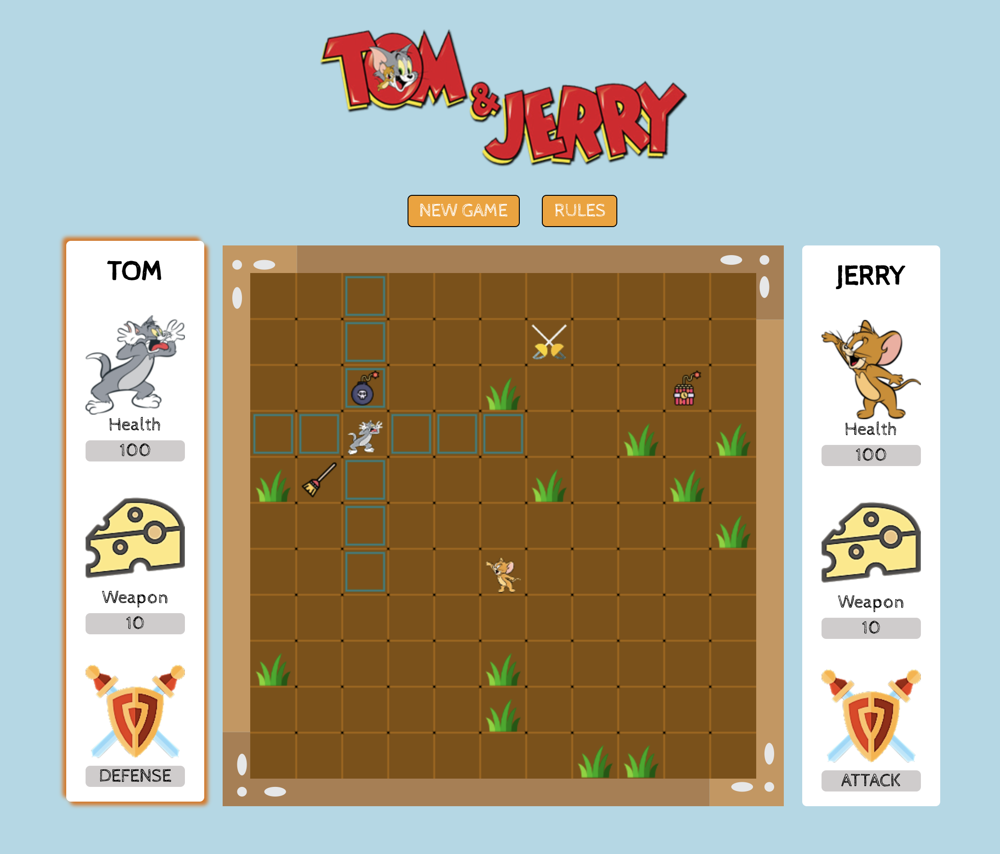

# Tom & Jerry
#### The 6th project at [OpenClassroom](https://openclassrooms.com)

`html` `css` `javascript` `canvas` `jquery` `gulp`

by [Thaison Dang](https://github.com/thaisonbk57)

Try the [DEMO](https://tom-and-jerry-sp.firebaseapp.com/)

# Description
This a small game built with `jquery` and `canvas (html5)`. There are 2 players moving in turn. Each players has initial lifepoints and their own weapon.

At the beginning of the game, players , weapon and obstacles are placed randomly on the map. Then players move their character around to get new weapon *(new weapon can be **more** or **less** powerful than the old one.)*

If 2 players stand next to each other, they will fight...

And how it works, please checkout the rules section in the game.

# Features

- random the power of each weapon after start a new game.
- moving the characters easily with mouse-click.
